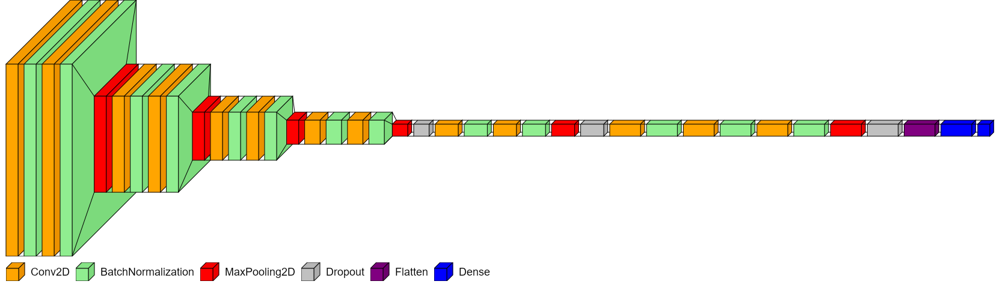
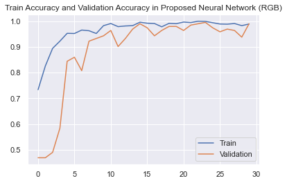
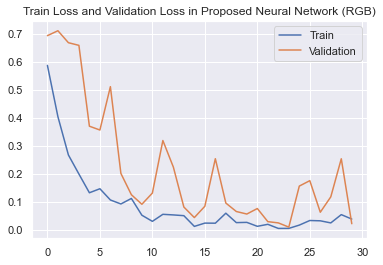
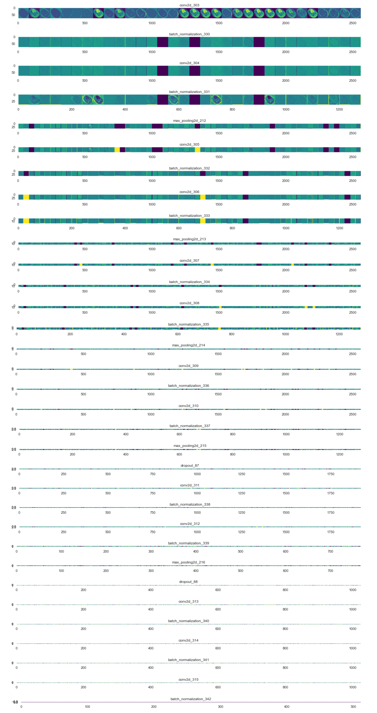

# Brain-MRI-Tumor-Classification-Using-CNN
A test run on the dataset. Tasks- Image Augmentation, Feature Map, High Evaluation Metrics, Accuracy Graph

## Experimental Setup:
- GPU: NVIDIA GeForce RTX 3080 Ti
- Compute Capability Memory: 8.6
- FP32 (float) Performance: 34.10 TFLOPS
- CUDA Version: 11.2
- TensorFlow(GPU) Version: 2.6.0
- Total Training Time: 1 Minute

## Model Type

- CNN
- Layers Used: Conv2D, BatchNormalization, MaxPooling2D, Dropout, Flatten, Dense.
- Learning Rate: 0.0001
- Activation Layer: ReLu, Sigmoid(Final Classifier Layer)
- Dropout: 15%
- Parameters: 10,150,626
- Number of Epochs: 30

## Dataset

- Real Dataset link: https://www.kaggle.com/navoneel/brain-mri-images-for-brain-tumor-detection
- Used Keras' ImageDataGenerator for augmentation
- Increased Data Size: 2007
- Image Type: Grayscale

## Evaluation Metrics:

- Accuracy: 0.9900
- AUC(Area Under ROC Curve): 0.9998
- Recall: 0.9955
- Precision: 0.9913
- F1: 0.9934

## Train vs Validation - Accuracy & Loss Graph:

 

## Feature Map:

